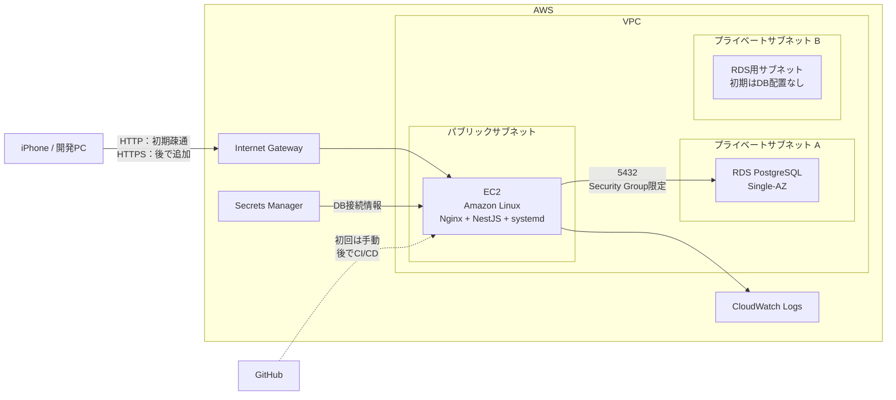

# AWS構成

EC2からRDS PostgreSQLへ接続し、外部からNestJS APIのヘルスチェックを実行できる最小構成とする。

## 初期構成に含めないもの

- ECS / Fargate
- Application Load Balancer
- NAT Gateway
- Route 53
- CI/CD
- Multi-AZ RDS

初回はEC2上でDockerを使用せず、Node.js、systemd、Nginxを利用してNestJSを実行する。
