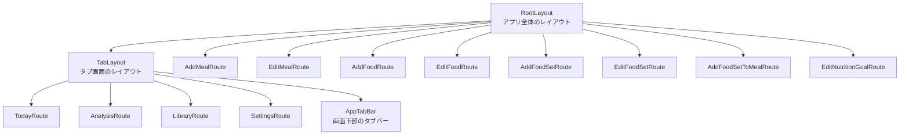
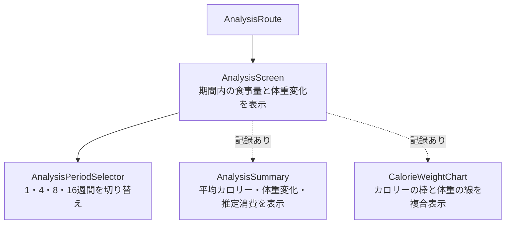
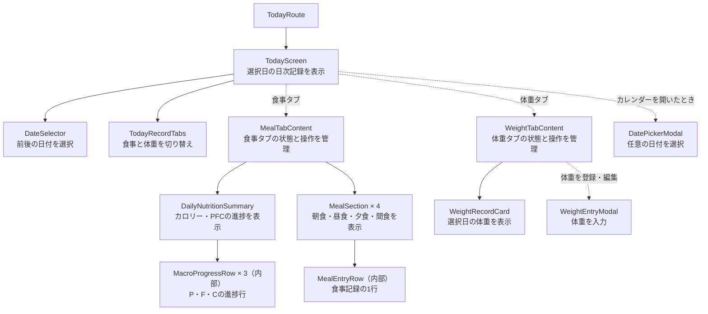
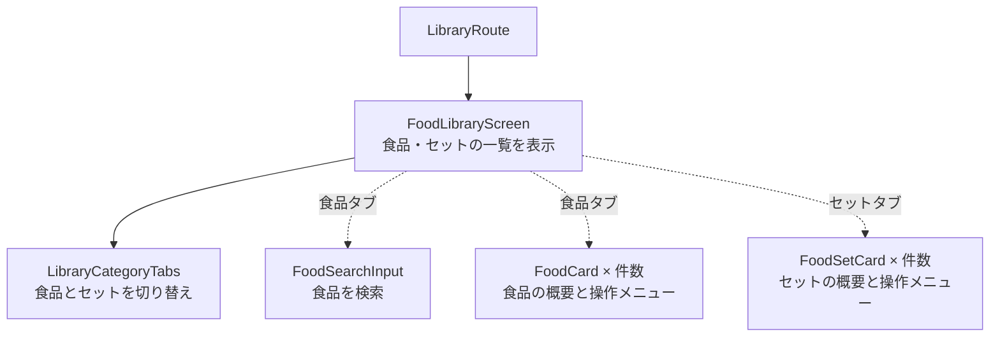
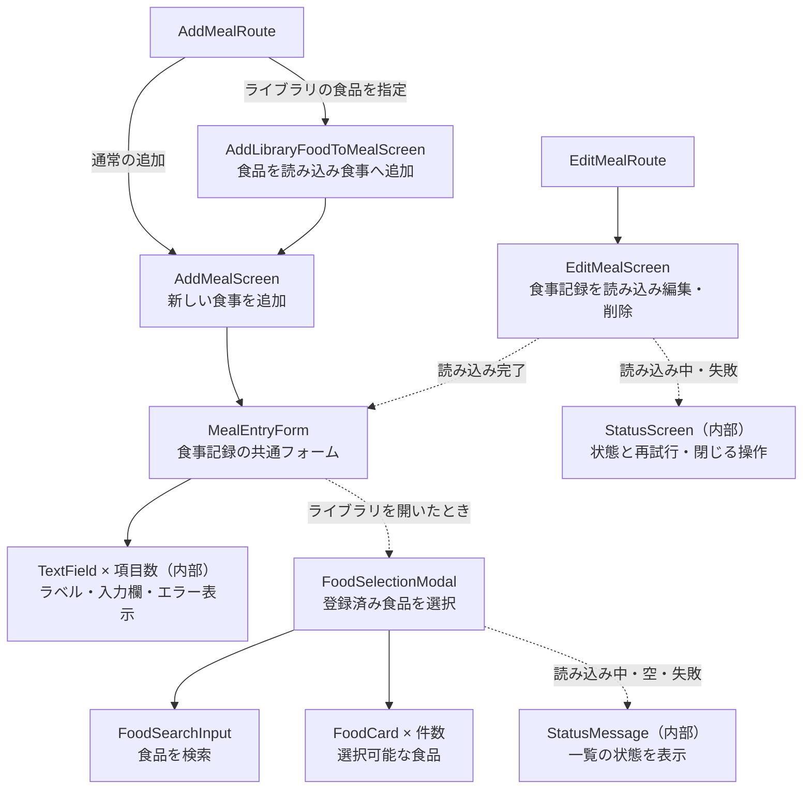
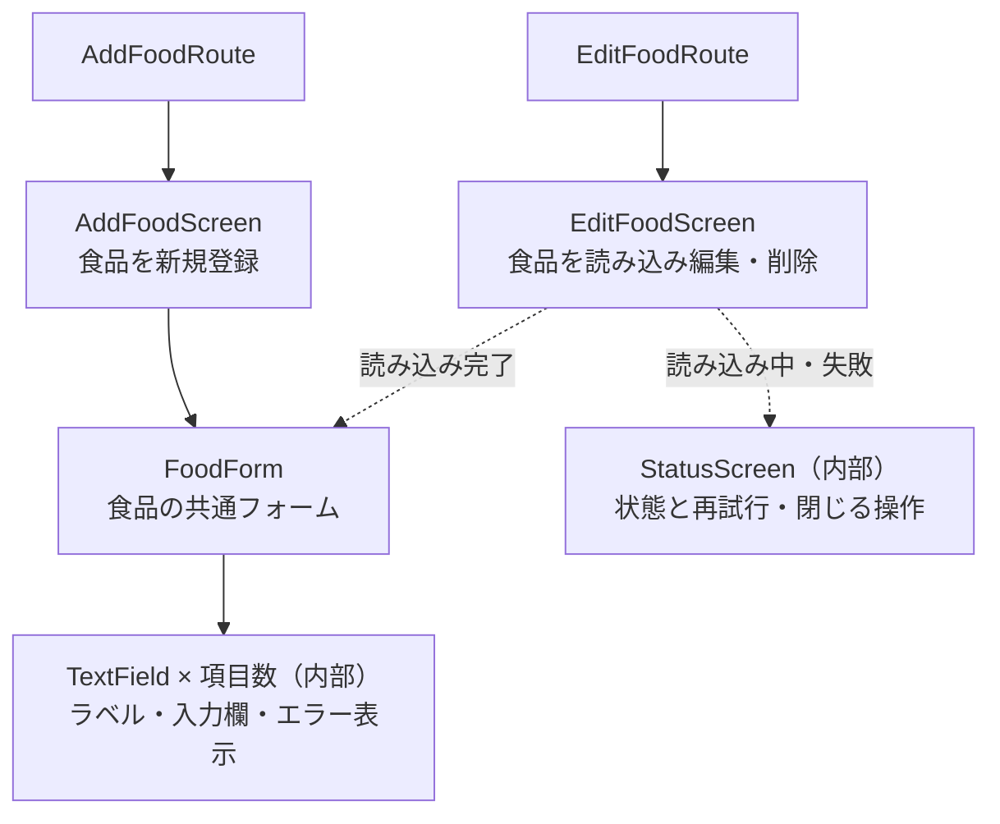
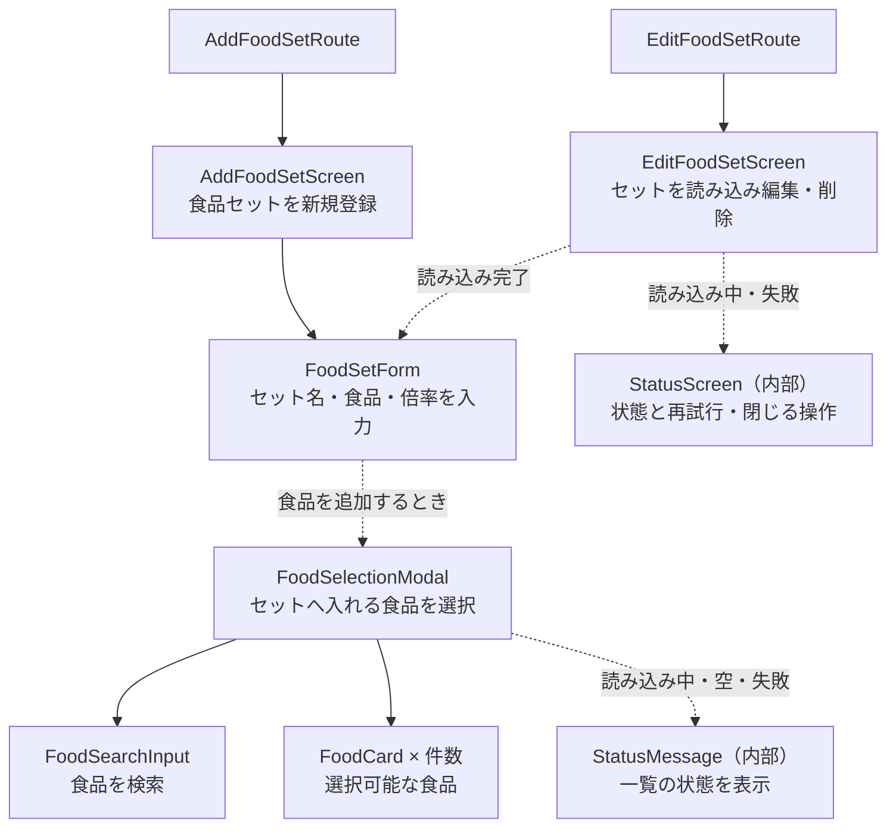
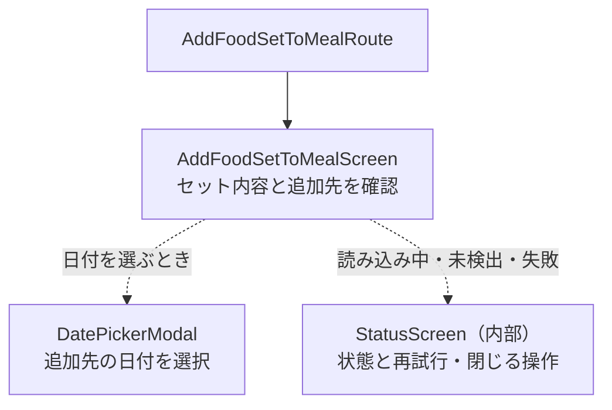
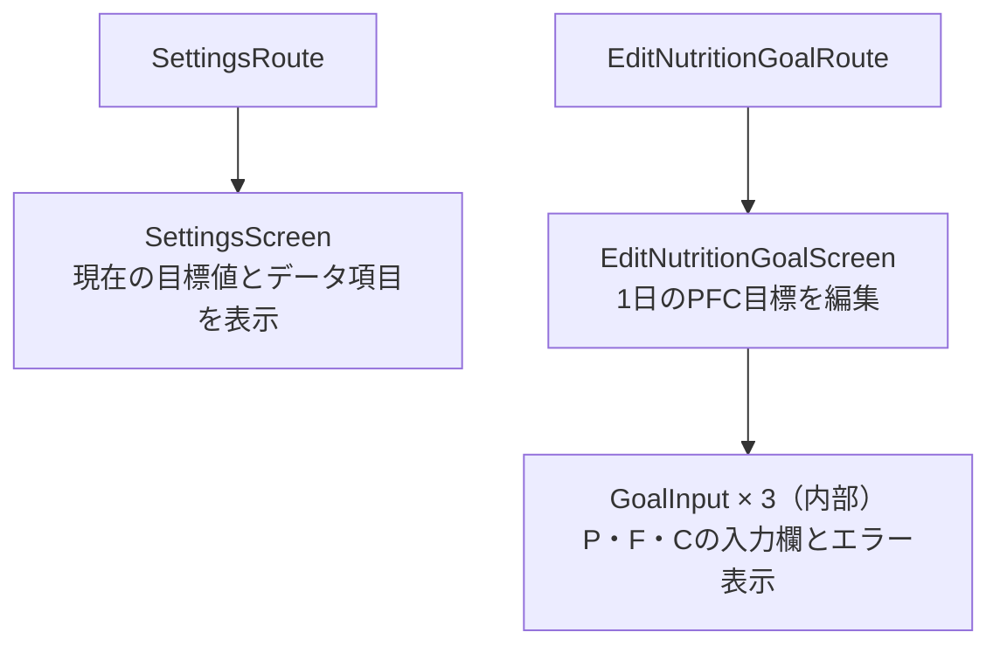

# コンポーネントマップ

FoodLogの各画面が、どの自作コンポーネントで構成されているかを確認するための地図。
コードレビュー時に画面の全体像を把握する用途で使用する。

## 記載ルール

- React Native標準の`View`、`Text`、`Pressable`などは省略する
- Repository、Service、型、データフローは記載しない
- 点線は、条件に応じて表示されるコンポーネントを表す
- `（内部）`は、同じファイル内で定義された非公開コンポーネントを表す
- UIのコンポーネント構成を変更したときは、該当する図も更新する

## アプリ全体

## 分析画面

## 今日画面

## ライブラリ画面

## 食事追加・編集画面

## 食品追加・編集画面

## 食品セット追加・編集画面

## 食品セットの食事追加画面

## 設定画面

